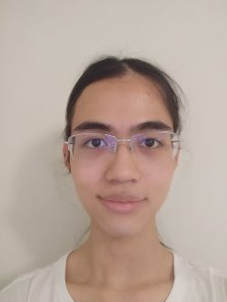

# Jiayan Dong's Page 
- [Go to About me as a programmer](#about-me-as-a-programmer)  
- [Go to About me as a person](#about-me-as-a-person)  
  
This is **Jiayan Dong's Page** for *CSE 110* at ***UCSD***  
## About me as a programmer  
My name is Jiayan Dong and I'm a junior computer science student at UCSD. I'm 21 years old and I can use the following programming languages proficiently:  
- C/C++
- Java
- Python
- assmebly for x86/arm  -Javascript
- html and xml  

## About me as a person  
In my free time, I like to:  
1. listen to music
2. read books
3. play video games.
4. travel around

By the way, I have a cat and he's name is fatty. Here is a relative link to the his photo [cat](./cat.jpg).

My favrite lyric is from *José González - Stay Alive*:  
> _We'll do whatever just to stay alive._  

My favrite programing language is C++:  
`cout << ""Hello World!" << endl`  

This is my main [github page](https://github.com/nonlighting/).  

Personal goal:  
- [x] Go to university
- [ ] Find an internship
- [ ] Find a job

Contact information: nonlighting@gmail.com or jid001@ucsd.edu
